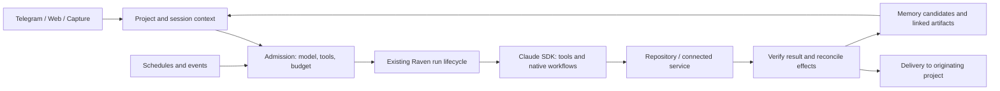

# Raven as a personal assistant — product and architecture plan

Prepared September 6, 2026, against `f74ab7a`. This is a proposed next phase, not a
claim that the features below are implemented. The completed F1–F9/W1 reliability
and workspace work remains the baseline. The accompanying
[delivery queue](../../_bmad-output/implementation-artifacts/personal-assistant-next-steps-2026-09-06.md)
turns the recommendations into reviewable implementation slices.

## Direction

Make Raven the place where an intention becomes remembered context, useful work,
and a verifiable result. Its distinguishing value should be continuity across the
owner's life: dissertation, teaching, administration, relationships, interests,
and time. A larger catalog of agents alone will not deliver that continuity.

The central experience should be: **capture → understand → plan → act → verify →
remember → follow up**. Every part must work from the phone. The owner should be
able to say “prepare next week's class,” “what am I forgetting?”, “I have 40
minutes,” or “continue the dissertation work,” without choosing an agent or
reconstructing context.

Keep these owner decisions: flexible project folders; direct work in attached
repositories; autonomous shell, scripts and Git under saved execution settings;
small explicit context indexes instead of repository embeddings; project-owned
files and memories; cheap workers with stronger review where useful. Agents may
evolve repository layouts and pipelines. Raven's project identity, task lifecycle
and recorded outcomes must continue to work as those layouts change.

## What Raven already provides

| Foundation                                                          | Current value                                                                        | Next missing experience                                                    |
| ------------------------------------------------------------------- | ------------------------------------------------------------------------------------ | -------------------------------------------------------------------------- |
| Managed projects and attached repositories                          | Canonical YAML, project context, direct shell/Git, flexible files, mobile previews   | Guided readiness and a clear starting point for each project               |
| Project agents and capability library                               | Explicit tool bindings and inherited context; specialists can do real work           | One project conversation with understandable attribution                   |
| Durable board/tree/run files                                        | Dependencies, retries, validation, interruption records and runtime-owned completion | A unified view of commitments, deliverables and what needs the owner       |
| Memory candidates and consolidation                                 | Bounded project Markdown with reviewed promotion                                     | An editable personal profile, provenance, correction and selective sharing |
| Schedules, templates and deterministic intents                      | Recurring work and event/time reminders                                              | Reliable, inspectable routines that can adapt within their remit           |
| Email, calendar, TickTick, voice, finance and notification services | Existing integration building blocks                                                 | Useful account-backed journeys and coherent notifications                  |
| Optional knowledge graph                                            | Existing links and project membership                                                | Better retrieval and explicit cross-project connections                    |
| SDK execution and budget admission                                  | Real tools, model tiers, cancellation, accounting                                    | Per-session model/effort choice and visible operational status             |

This assessment is based on source inspection, not assumptions that every
configured integration is authenticated or that every shipped template is useful.
The SDK maintenance accompanying this plan passed 2,467 default tests; the
preceding workspace browser change passed three affected browser journeys. Those
are separate checks of their respective boundaries, not a measurement of
personal-assistant usefulness. See [maintenance evidence](2026-09-06-sdk-maintenance.md),
[architecture](../../ARCHITECTURE.md),
[workspace completion](../../_bmad-output/implementation-artifacts/tech-spec-w1d-browser-workspaces.md),
and the [deferred ledger](../../_bmad-output/implementation-artifacts/deferred-work.md).

## What to learn from other products

The comparison uses current vendor documentation, accessed September 6. It is not
a hands-on benchmark or a claim about every plan's availability. “Borrow” below
is a design recommendation for Raven.

| Product                                          | Documented pattern worth studying                                                                                                                                                                                                                                                     | What Raven should borrow                                                                                                                                   |
| ------------------------------------------------ | ------------------------------------------------------------------------------------------------------------------------------------------------------------------------------------------------------------------------------------------------------------------------------------- | ---------------------------------------------------------------------------------------------------------------------------------------------------------- |
| ChatGPT / Work / Codex                           | Projects group context and conversations; local projects attach folders. Scheduled tasks can use skills, and eligible web/mobile plans support app-event triggers. [Projects](https://learn.chatgpt.com/docs/projects), [tasks](https://learn.chatgpt.com/docs/automations)           | A project can contain several focused conversations; work continues through visible runs with reusable instructions. Make starting and resuming work easy. |
| Claude Cowork                                    | Works across files and connected tools, delivers artifacts, supports remote interaction and unattended work. Its productivity plugin uses editable task and memory files. [Cowork](https://claude.com/product/cowork), [productivity plugin](https://claude.com/plugins/productivity) | Deliver the actual document, updated file or prepared decision. Keep the assistant's learned working context inspectable.                                  |
| OpenClaw                                         | A self-hosted assistant gateway across messaging channels, with Markdown profile, durable memory and dated notes. [Assistant setup](https://docs.openclaw.ai/start/openclaw), [memory](https://docs.openclaw.ai/concepts/memory)                                                      | Frictionless mobile capture, a compact user profile, and useful continuity across sessions. Raven can retain its own project and artifact strengths.       |
| Lindy                                            | Its current documentation emphasizes a shared assistant in Slack, reusable skills/routines, editable files and completed cross-tool work. [Current product documentation](https://docs.lindy.ai/)                                                                                     | Teach a process once, invoke it naturally, and get the completed outcome in the conversation where the work began.                                         |
| Notion Custom Agents                             | Recurring schedules and events in Notion/Slack can trigger agents with scoped context. [Custom Agents](https://www.notion.com/help/custom-agents)                                                                                                                                     | Link discussions, documents, changes and tasks; make triggers, permissions and recent runs understandable.                                                 |
| Reclaim                                          | Its 2.0 documentation describes flexible focus/habit scheduling, overload detection and previewing calendar changes; availability is rollout-dependent. [2.0 overview](https://help.reclaim.ai/en/articles/14846468-reclaim-ai-2-0-overview)                                          | Protect dissertation time, account for teaching obligations, and explain what has to move when the day changes.                                            |
| Claude Code dynamic workflows and cloud routines | Native workflow scripts coordinate agents; cloud routines package unattended work with schedule/API/GitHub triggers. These are separate capabilities. [Workflows](https://code.claude.com/docs/en/workflows), [routines](https://code.claude.com/docs/en/routines)                    | Reusable, outcome-oriented automation with visible execution. Evaluate native orchestration before building more custom orchestration.                     |
| Home Assistant                                   | Assist supports natural-language home control and can run on the owner's hardware. [Assist](https://www.home-assistant.io/voice_control/)                                                                                                                                             | Later, connect physical routines through the existing home platform rather than implementing device protocols in Raven.                                    |

The common useful pattern is reducing repeated coordination: retrieving a
decision, preparing for an event, capturing a commitment, producing an artifact,
or following through after a delay. Public user feedback also highlights how
fragmented input and poorly timed reminders undermine assistants. Treat this
[first-person discussion](https://www.reddit.com/r/n8n/comments/1uwqg9a/building_an_ai_second_brainadhd_assistant_which/)
as qualitative input, not representative evidence of demand. Test the hypotheses
against the owner's actual week.

## Priorities

P0 makes the existing assistant dependable and comfortable to use. P1 makes it
personally useful every week. P2 expands across life domains after those loops
work. P3 is optional exploration. Effort bands in the delivery queue include
implementation and testing; they are estimates, not calendar promises.

| Priority | Addition                                               | Concrete benefit                                                                    |
| -------- | ------------------------------------------------------ | ----------------------------------------------------------------------------------- |
| P0       | Project-based Telegram and consistent delivery         | Know what every message refers to and continue work in the right context            |
| P0       | Session model, effort and thinking controls            | Use Fable for difficult dissertation reasoning and cheaper models for routine work  |
| P0       | Workspace/integration readiness and phone access       | See whether tools, mounts, authentication and artifact links actually work          |
| P0       | Targeted dependency and skills maintenance             | Remove stale integration paths and assess the official TickTick option              |
| P1       | Capture inbox and commitment tracking                  | Voice notes, links, messages and files become findable items with a next step       |
| P1       | Personal context with provenance and correction        | Stop explaining preferences and history repeatedly; correct misunderstandings once  |
| P1       | Today view, weekly review and calendar coordination    | Get a realistic plan across projects and notice neglected commitments               |
| P1       | Dissertation and teaching workflow packs               | Repeatable, checked research and teaching deliverables in the existing repositories |
| P1       | Routine authoring and native workflow experiment       | Turn “do this regularly” into durable, inspectable automation                       |
| P2       | Meeting preparation and follow-through                 | Recover decisions, prepare agendas and track promised responses                     |
| P2       | Household, money, health administration and travel     | Manage recurring obligations and documents with less manual tracking                |
| P2       | Browser operation and additional connectors            | Complete tasks where the existing APIs and repository tools are insufficient        |
| P3       | Continuous voice, ambient context and home integration | Add hands-free assistance once capture and follow-through are already reliable      |

## Telegram: proposed project-based experience

Current Telegram code still mixes named topics, agent routing and in-memory project
maps. It can forward general AgentManager completions without an explicit Telegram
destination, and the send fallback can hide failure before marking a notification
delivered. Fix delivery truth and ownership first; the following is target behavior.

Use one private Raven forum group with one topic per active project. Keep
**General as Inbox / Today**: quick capture, a compact daily overview and genuinely
cross-project questions. Project progress belongs in its project topic. Service
logs belong in the dashboard; operational problems enter General only when they
need owner action, with the affected project named.

Dissertation and Teaching each get a stable topic. Add Personal Admin, Home,
Health or Travel only when used; do not create a dozen empty topics during setup.
Agents are contributors inside topics, not separate destinations. A message might
read “Research reviewer · Dissertation: two references need checking” with a link
to the result. Raven provides the final synthesis; worker chatter is collapsed
into a progress message or available through the browser.

Keep private bot chat usable as well: it starts in Inbox and offers explicit project
selection. Forum topics are the recommended organization, not a setup requirement
for capturing something from a phone.

Each topic binds to a stable project ID. Multiple focused Raven sessions can live
inside that project: a reply to an older result continues its originating session,
while `/new` starts a fresh conversation in the same project. Ordinary unthreaded
messages use the topic's explicitly selected current session. Never infer project
ownership from an agent name, topic title or notification category. Renaming a
project should not change its identity or fork history.

Useful controls: New conversation, Continue, Status, Stop, Model, Open project,
Open result, Snooze, Done and Move to project. Natural-language requests remain
the primary interface. A captured item gets an immediate receipt, then one final
outcome. Batch adjacent text/link/media messages into one capture when appropriate,
without merging separate commands or losing original Telegram message IDs.

General must have a clear contract:

- Incoming item without a project: save it to Inbox, suggest a destination, and
  let one tap or reply correct it. Preserve the original source.
- Daily overview: a small set of priorities, decisions needed and cross-project
  conflicts, with links into the relevant topics.
- Project completion: deliver once to that topic. General may include its status
  in the next overview, without reposting the entire result.
- Background activity: stay quiet unless there is a material result or blocker.

Existing quiet hours, urgency, snoozing and feedback mechanisms should be reused.
Every proactive message should explain why it appeared and offer a useful next
action. Failure to find a destination must produce a visible routing problem,
not silent delivery to the wrong conversation.

## Model controls, including Fable

Anthropic documents **Claude Fable 5.1**, released September 1, for demanding
reasoning and long-running agent work. Thinking is always adaptive/on for that
model. Effort is adjustable; it affects reasoning and tool use rather than being
a strict spending limit. Availability in this Raven installation still depends
on its authenticated account and provider. [Fable 5.1](https://platform.claude.com/docs/en/models/fable-5-1/overview),
[effort](https://platform.claude.com/docs/en/build-with-claude/effort).

The installed SDK types already expose `thinking`, `effort`, `supportedModels()`
and model capability metadata. Raven's `BackendOptions` forwards none of the
thinking/effort settings; named-agent schemas accept only Haiku/Sonnet/Opus.
Model IDs are mapped in `agent-resolver.ts`. Updating a package alone will not
add the missing product controls.

Offer simple presets and an advanced selector:

| Preset   | Starting recommendation                                        | Intended use                                                           |
| -------- | -------------------------------------------------------------- | ---------------------------------------------------------------------- |
| Quick    | Available inexpensive model, low/medium effort where supported | Capture, classification, formatting and routine lookups                |
| Everyday | Sonnet 5, medium effort                                        | Ordinary project conversation and repository work                      |
| Deep     | Opus 5, high effort                                            | Difficult planning, substantial writing and review                     |
| Frontier | Fable 5.1, high effort; xhigh/max deliberately selected        | Dissertation arguments, difficult synthesis and hard research problems |

These are hypotheses to evaluate on the owner's tasks. A strong model cannot
replace source checking, reproducible computations or a domain-specific rubric.
Use inexpensive implementation/retrieval workers and a stronger reviewer only
where measured improvement warrants it. Show the actual resolved model and effort
beside every run. Never silently downgrade a deliberately selected model.

Precedence: turn override → session setting → project default → named-agent
default → installation default. Save the resolved configuration at admission so
queued work does not change when settings are edited. Validate against available
model capabilities, including mandatory thinking, supported effort levels and
permission-mode compatibility. Retain explicit IDs and friendly presets instead
of adding another closed enum every time a model launches.

First deliver **switch for the next turn in the same Raven conversation**.
Raven currently makes one SDK query per turn and includes model configuration in
the SDK resume revision. A changed model can therefore start a fresh provider
session. Preserve the visible conversation and provide a bounded, source-linked
handoff when safe resume is unavailable. Test the model switch with a fact from
earlier turns; a selector that forgets the conversation is not complete.

Live switching during an in-flight response is a separate feature. Installed
`setModel()` is documented for streaming input mode, while Raven uses a string
prompt per query. Add it only after the streaming lifecycle and cancellation
contract are tested. Keep workspace/capability revocation checks intact; do not
remove resume guards merely to make switching appear seamless. Provider-specific
per-message effort APIs must not be assumed to map directly to the Agent SDK.

## Library and integration maintenance

Dependencies received a security review on September 5, and the repository/document
skills were updated during the workspace work. The targeted outstanding upgrade
is the Claude Agent SDK: `0.3.224` dates to Raven's August 7 update. A narrow
upgrade to the reviewed `0.3.261` release is complete, with the full default suite,
SDK contract, compiled restart and clean production image passing. The running
test deployment was left unchanged. [Maintenance evidence](2026-09-06-sdk-maintenance.md).
Direct npm verification also found `0.3.263`; its release changes were not available
in the fetched official changelog, so that newer update remains a follow-up.
[SDK release](https://github.com/anthropics/claude-agent-sdk-typescript/releases/tag/v0.3.261).

TickTick now has an official MCP service at `https://mcp.ticktick.com`. Its public
guide describes Streamable HTTP, OAuth or Bearer authentication, and tools for
habits, focus records and countdowns as well as broader task organization. That
makes it a useful expansion beyond Raven's local task adapter. Prefer the official
service after checking actual tool parity, unattended authentication and Raven's
permission mappings; the current library only configures stdio MCP servers.
[Official TickTick MCP guide](https://help.ticktick.com/articles/7438129581631995904).

Repair the obsolete Google Workspace skills updater before using it: it currently
targets the removed `suites/` tree and changes a global CLI as a side effect.
Make selected skill imports versioned, reviewable and consumed by the actual
capability library. The delivery queue contains the exact maintenance inventory,
candidate versions, test gates and recommended new skills. A broad dependency or
marketplace update is not a substitute for proving that a workflow works.

## Personal context: know the relevant things and why they are believed

Build on project Markdown memory. Add a compact personal profile and an explicit
way to share selected facts into projects. Keep long-lived life areas as ordinary
projects with lightweight metadata, and connect finite projects to those areas.
This avoids creating a second hierarchy or rigid folder convention.

The profile should grow through useful work: preferred language and writing style,
working hours, goals, constraints, important people, recurring obligations and
decision preferences. Start with a short editable draft and ask one contextual
question when an answer would improve a real task. Avoid a long onboarding survey.

Distinguish facts the owner stated, observations from sources, tentative
inferences, decisions and temporary plans. Record source links, observed dates,
scope and superseded state. “I prefer mornings for writing” can become a current
preference; “you seem tired on Mondays” remains an unconfirmed observation.
Corrections must supersede the earlier fact and invalidate stale summaries.

Support “what do you know about me?”, “why do you think that?”, “remember this
only in Teaching”, and “forget this.” Retention and forgetting must cover derived
indexes and summaries, with transcript handling made explicit. Do not promise
deletion from historical backups when those backups have their own retention.

Use bounded retrieval: compact personal facts + current project context + relevant
memories + linked authoritative files. Retain the existing graph for useful
relationships and membership. Repositories still need only overview/index links.
Cross-project assistance should carry selected facts and cited connections rather
than silently loading every project's complete contents.

Good cross-project use: a dissertation concept could improve an upcoming lesson;
a teaching deadline reduces the available writing time; a trip affects calendar
availability. Surface the connection and its source, and let the owner correct
or dismiss it. Rank memory changes by usefulness, not by how many notes Raven can
accumulate.

## Capture, commitments and the daily plan

Create one Inbox for a voice thought, photo, forwarded email, URL or unfinished
request. Preserve the original and extracted text. Store the item before any
model classification and acknowledge it even if transcription or a connector is
temporarily unavailable. A correction should move the same item, not make a copy.

Treat tasks, events and promises as linked records with an authoritative owner.
TickTick remains authoritative for its task fields, the calendar for events, and
Raven for its execution trees, internal tasks and artifacts. Keep stable external
IDs and source versions; avoid making three independently editable copies of one
task. Separate “I should do this,” “Raven is doing this,” and “waiting for someone.”

The Today page should answer: what matters, what fits, what is blocked, what
needs a decision, and what Raven finished. Reuse existing task/history views;
add a coherent projection rather than another task store. One morning brief and
one weekly review are enough to begin. Include actual findings and links instead
of “briefing compiled—check the digest.” The shipped morning-briefing template's
static notification is a concrete example to improve.

Calendar planning should respect fixed teaching sessions, deadlines, travel,
buffers, energy preferences and protected research blocks. Explain tradeoffs:
“There are two free hours before Friday; completing all three items requires
moving something.” Let the owner grant standing authority for moving flexible
blocks. Changes outside that authority should be presented as a concrete proposal.

Follow-through is more valuable than repeated reminders. Track whether a promised
reply arrived, a blocked task became actionable, or a draft still needs review.
Snoozing should retain context. After inactivity, offer “While you were away” with
decisions, important changes and the next useful action.

## Dissertation and teaching as the first complete workflow packs

**Dissertation:** maintain a claim/evidence matrix; distinguish primary evidence,
interpretation and open questions; track citations back to real sources; rerun
repository computations; compare chapter changes against the argument; prepare a
supervisor meeting packet; produce a checked PDF and concise change summary.
Keep the existing literature/index conventions and output directories. Add a
Zotero adapter if Zotero is actually used; its official API supports structured
library access, so a third-party MCP is optional. [Zotero API](https://www.zotero.org/support/dev/web_api/v3/basics).

**Teaching:** start from the next lesson and current course state; prepare an
outline, exercises, variants at different difficulty levels and instructor notes;
run the existing render pipeline; check references and examples; deliver browser
previews. Separate generated outputs from authoritative sources according to the
repository's own conventions. Handle student-specific records under explicit
project policies; do not automatically promote them into global personal context.

**Research-to-teaching bridge:** when a new dissertation result matches a teaching
topic, propose a source-linked example or exercise. **Preparation memory:** retain
what worked in a lesson or meeting so the next preparation improves. These are
high-value uses of linked project memories without a repository embedding project.

The capability library needs focused workflows, with local scripts remaining
authoritative. Add research verification, reproducible analysis, lesson preparation
and meeting preparation skills; reuse the existing document/media skills. Promote
only reusable methods into the global library, leaving course content, manuscript
details and local tool commands in their project repositories.

## Adaptive automation and the earlier enterprise research

The earlier agent-frameworks research is in the August
[evidence appendix](2026-08-06-assessment-appendix.md), with its synthesis in the
[architecture assessment](2026-08-06-architecture-assessment.md) and related March
planning material. No separate enterprise/n8n research file was located in the
tracked repository.
They discuss n8n-style workflows and the SDK Workflow tool. Their descriptions of
broken task completion and several competing engines are historical; September
work fixed or removed those paths. Their small-runtime principle remains useful.

Current Claude documentation confirms native **dynamic workflows**: reusable
JavaScript orchestration of subagents, with script-held intermediate results and
same-session resume. Workflow invocation from SDK input has origin requirements;
unmarked programmatic or scheduled text does not get the human keyword trigger.
Cloud **routines** are different: Anthropic-hosted scheduled/API/GitHub runs, which
do not automatically inherit Raven's local mounted repositories. [Dynamic workflows](https://code.claude.com/docs/en/workflows),
[cloud routines](https://code.claude.com/docs/en/routines).

This is a promising fit for research and document production. My recommendation
is a bounded native-workflow experiment inside one Raven task before implementing
a new custom dynamic DAG. Raven should own project identity, triggers, admission,
durable run status, delivery and output verification; the SDK can own reasoning,
delegation and the inner workflow. A workflow appearing in SDK types does not
prove that Raven observes its entire background lifetime or accounts for it
correctly. Verify those boundaries first.

For routine work, use the simplest mechanism that works: an existing script for a
repeatable computation, a normal agent task for one deliverable, an existing tree
for explicit dependencies, and native workflow orchestration for meaningful
parallelism or branching. A saved routine should record its outcome, inputs,
trigger, project, permitted effects, budgets and acceptance checks. Let the agent
choose methods inside that contract.

An adaptive routine should be able to react to changed inputs, revise a draft,
repair a script, select a different approach and create supporting tools. Stable
external effects need idempotency or reconciliation. Version changes to reusable
instructions/scripts, run their tests, compare results with the previous version,
then activate through Raven's existing scaffold/reload path. Under standing owner
authority, this can happen automatically with a change record and rollback route.
Changes to that authority require an explicit decision.

The initial experiment should answer whether SDK workflows preserve Raven MCP
scope, workspace checks, artifacts, budget, cancellation and restart semantics.
Compare one research packet implemented as a normal task/tree and as a native
workflow. Measure result quality, cost, elapsed time, recovery and custom code
required. Keep the better approach. Replacing a template or engine must retire
its predecessor, not create a parallel scheduler and run-history system.

Separately repair the existing routine contracts before promising unattended
adaptation: event filters, current definitions after reload, project schedules,
output handoff, and unsupported template options. The delivery queue records
specific source findings and checks. File persistence is not an exactly-once
guarantee for sending an email or updating a remote task.

## Broader life features

| Area                    | Useful first workflow                                                                                     | Prerequisite / priority                                                      |
| ----------------------- | --------------------------------------------------------------------------------------------------------- | ---------------------------------------------------------------------------- |
| Personal administration | Renewal/deadline tracking, receipt filing, a document packet for an appointment                           | Capture + calendar; P2                                                       |
| Money                   | Explain categorized spending, flag subscriptions or unusual changes, prepare a monthly review             | Verify existing finance sync and source freshness; P2; no automatic payments |
| Health and wellbeing    | Appointment preparation, owner-recorded routines, exercise time and questions to discuss with a clinician | Explicitly chosen data sources and personal scope; P2                        |
| Relationships           | Remember promised follow-ups, birthdays and topics to revisit; prepare drafts in the owner's style        | Personal context + communications authority; P2                              |
| Travel                  | Build an itinerary and document checklist, track reservation changes, prepare offline essentials          | Email/calendar + artifact delivery; P2                                       |
| Home                    | Maintenance schedules, appliance documents, shared shopping needs                                         | Capture + reminders; P2; physical device control later                       |
| Learning and hobbies    | Turn saved reading into a short learning plan, practice prompts and a small next project                  | Reading queue + project context; P2                                          |
| Meetings                | Agenda from prior commitments; recording/transcript into decisions, tasks and follow-ups                  | Existing transcription exposed through project-scoped service access; P1/P2  |

Creative additions worth testing: a “40 minutes available” button; a low-energy
version of today's plan; a monthly review of abandoned goals; reminders tied to
an actual event rather than repeated polling; a decision journal that revisits
assumptions after results arrive; and an “away mode” that bundles nonurgent work
until the owner returns. None needs a permanently running agent for every life
area. Start with skills and instantiate specialists when useful.

## Architecture changes that earn their complexity

Keep the current monolith and SDK backend. Extend the existing project, session,
task, scheduler, notification and memory paths. File-owned definitions and tasks
remain canonical; SQLite can hold operational delivery attempts, cursors and
deduplication state; Neo4j retains its existing relationship role.

Five additions have a clear purpose:

1. A shared project/session delivery address so Telegram, browser replies,
   approvals, notifications and artifacts refer to the same work.
2. A model configuration contract used by settings, admission, queue, backend,
   budgets and history.
3. Provenance and lifecycle metadata for remembered facts, captures and external
   references, using existing stores instead of a separate “second brain.”
4. Durable delivery/effect attempts with explicit unknown outcomes and provider
   reconciliation, building on existing notification and provider-cleanup patterns.
5. A capability catalog that reports installed version, upstream source, required
   tools, authentication readiness and last successful check.

Full workspace mode is trusted host access, not isolation. The product must not
claim that project boundaries sandbox arbitrary shell commands. Keep autonomy
consistent with the owner's saved policy, and make failures actionable. Protect
against accidental duplication, stale assumptions and wrong destinations through
runtime checks and observable outcomes, not prompt wording alone.

Phone access deserves a supported deployment path: one HTTPS origin for dashboard,
API, WebSocket and artifact links, with owner access control. The current Compose
defaults bind loopback and compile localhost endpoints; existing docs describe a
proxy but do not provide it. A private tailnet is a suitable first option;
[Tailscale Serve](https://tailscale.com/docs/features/tailscale-serve) can proxy a
local service to authorized devices. This is a proposed setup, not an integration
installed by this assessment.

Do not prioritize another graph database, a custom vector index over repositories,
a visual n8n clone, a large roster of agents, a multi-provider execution rewrite,
or continuous recording. Each would increase upkeep before establishing the
daily workflows that justify it.

## How to judge progress

Use a small owner-specific evaluation set: capture a voice commitment; correct a
misfiled item; retrieve a decision with its source; switch to Fable without losing
context; prepare one class; produce one checked research packet; reschedule a day;
recover an interrupted routine; open its artifact from a phone; and correct a
remembered preference.

Track completed useful outcomes, correction effort, duplicate/lost actions,
notification usefulness, source freshness, cost and time. Targets for a first
two-week trial: every accepted input is retrievable, every claimed result links
to evidence, no wrong-project delivery, no duplicate mutation in retry tests,
and a clear reduction in the owner's preparation or coordination work. Ask the
owner which suggestions helped rather than inferring usefulness from message
volume. Keep account canaries and subjective usefulness separate from automated
test counts.

Ship small vertical slices, use them, and adjust priorities. The first release
should make Telegram and model choice comfortable. The next should complete a
daily planning loop and one substantial repository workflow. Broad life coverage
then becomes a series of small, reusable additions to an assistant already worth
using.
